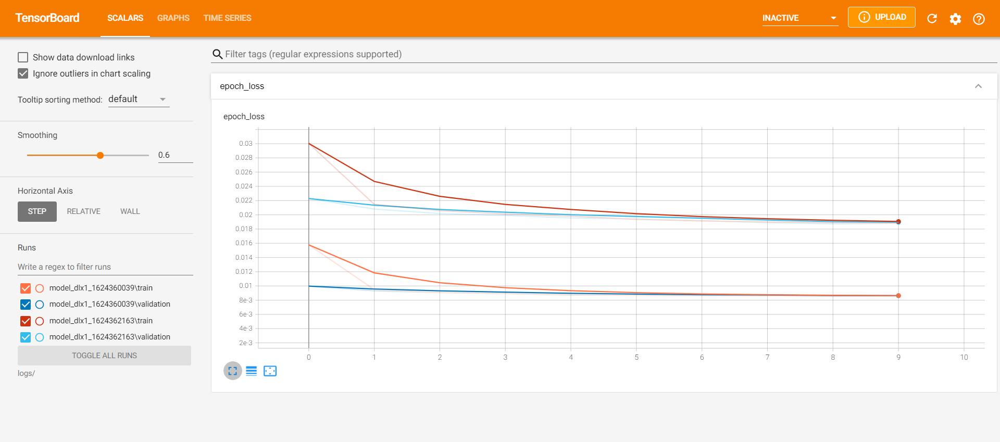

# <strong>Autoencoders</strong>

 

Autoencoder is an <strong>unsupervised Learning</strong> approach. It is an Artificial Neural Network(ANN) that learns to capture important piece of information (features) from a given data. An Autoencoder forms a representation of the actuall data into a samll maxtrx also known as latent sapce.

 

To know more visit - [Machine-Learnes.herokuapp.com](https://machine-learns.herokuapp.com/)

 

<strong>Model Performence</strong>
---

